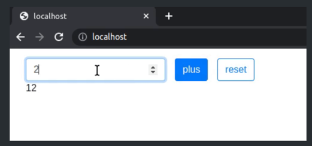

This project implements a simple sum calculator. It can do so for any amount of numbers. 

## src/application.js

The app is implemented as a function exported by default. The calculator comprises an input and two buttons: add and reset. The sum is displayed under the input, and is 0 when the app is first launched. Each click on the plus button add the input value to the current sum to get a new sum. The reset button resets the sum to 0.

The input gets focus when the form is rendered and after each submit or reset.

Both submit and reset clear the input.
